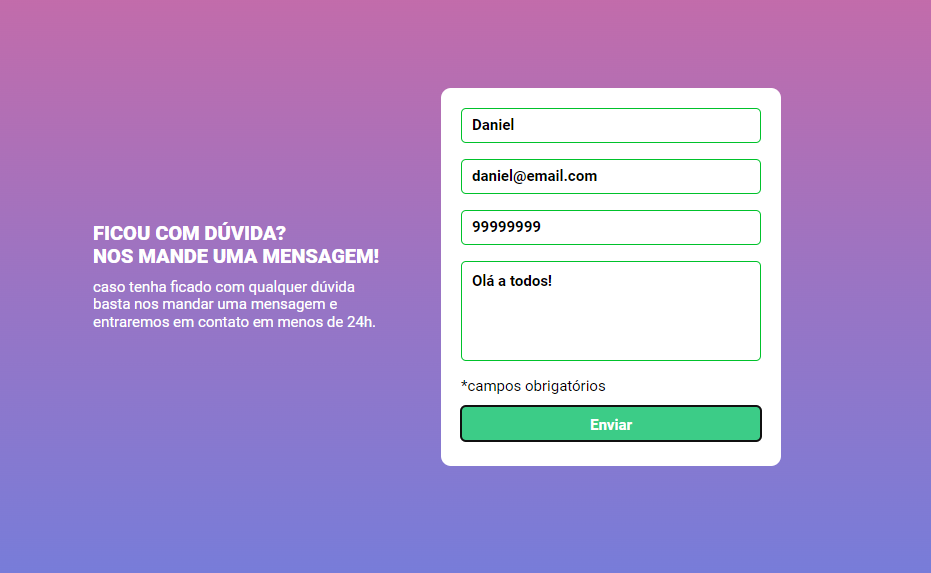
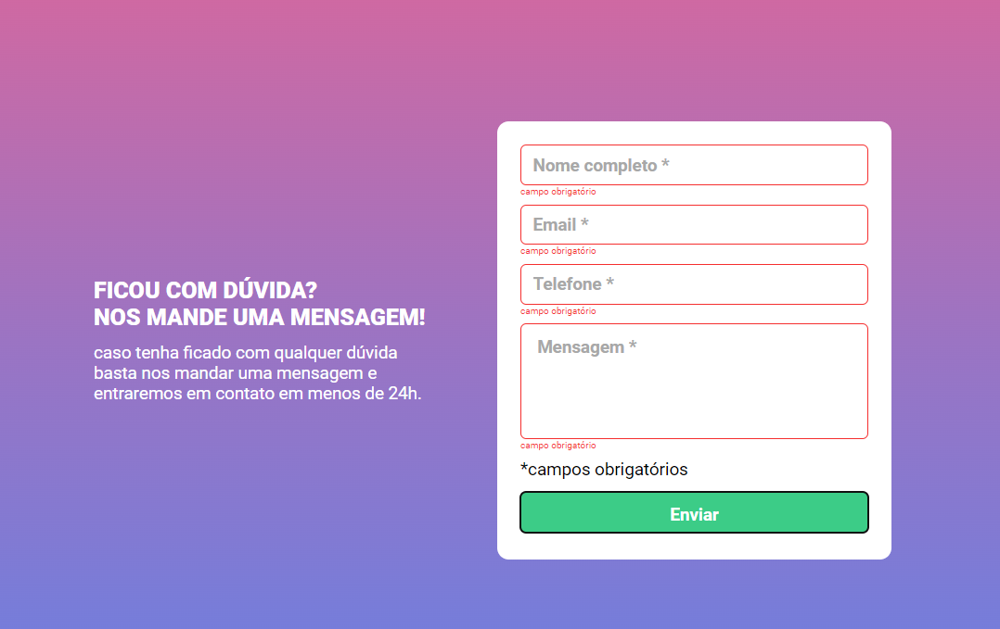

# Quest HTML + CSS + JS intermediário - Desafio - Formulário com validação 
Solução do desafio proposto no curso DevQuest, com o objetivo de aprender HTML e CSS e JS.

## Table of contents

- [Visao Geral](#visao-Geral)
  - [Sobre o desafio](#sobre-o-desafio)
  - [Screenshot](#screenshot)
  <!-- - [Links](#links) -->
- [Sobre o processo](#sobre-o-processo)
  - [Ferramentas utilizadas](#ferramentas-utilizadas)
  - [O que eu aprendi](#o-que-eu-aprendi)
- [Autor](#autor)
- [Conhecimentos](#conhecimentos)

## Visao Geral

### Sobre o desafio

- Fazer um formulário e valida-lo utilizando javascript puro.

### Screenshot
#### Desktop Screenshot

## Sobre o processo

### Ferramentas utilizadas

- HTML 5 
- Estilização com CSS
- Flexbox
- JS - Intermediário
- Responsividade

### O que eu aprendi

Nesse exercício aprendi a utilizar o JS para complementar os meus sites e deixar eles mais dinamicos.

## Autor

- Linkedin - [Daniel Borguezani](https://www.linkedin.com/in/daniel-borguezani-903460223/)
- Frontend Mentor - [@Borguezani](https://www.frontendmentor.io/profile/Borguezani)
- GitHub - [@Borguezani](https://github.com/Borguezani)

## Conhecimentos

Apliquei conhecimentos de HTML e CSS (flex-box).
Para esse desafio proposto foi necessário a utilização de conhecimentos em JS.
Todos os conhecimentos foram adquiridos no curso DevQuest🚀.
